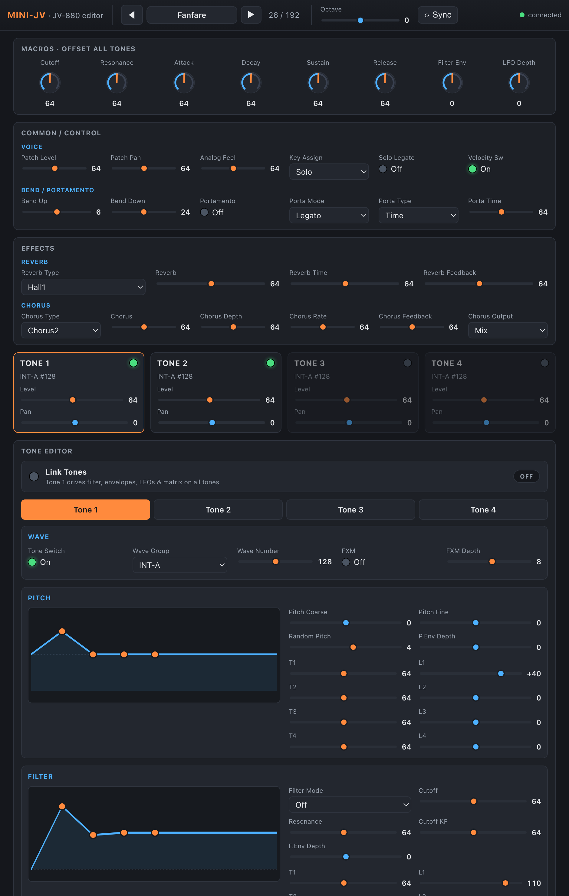

# Mini-JV editing UI

This module exposes the JV-880's patch and per-tone parameters for editing — both
on the Move's chain-slot menu and in a graphical schwung-manager remote UI.

## On-device (chain-slot menu)

The **Mode** page picks Patch or Performance, and the two are separate sets of
pages — the host roots its walk at the active mode, so patch editing is absent
in Performance mode and part editing is absent in Patch mode. That is the
instrument, not a restriction: the patch pages edit *a* patch, and a
performance plays eight of them.

### Patch mode

- **Macros** — 8 knobs that offset cutoff / resonance / ADSR / filter-env / LFO
  depth across all tones at once.
- **Common / Control** — patch level/pan, octave, bend range, portamento, key
  assign, solo legato, velocity switch.
- **Effects** — reverb & chorus type / level / time / feedback / output.
- **Edit Tones → Tone 1–4** — per-tone Wave, Pitch, Filter, Amp, LFO 1/2, and the
  Mod / Aftertouch / Expression control matrix.
- **Link all to 1** (bottom of Edit Tones) — see *Subtractive link mode* below.
- **Save to Slot** — write the working patch to one of the 64 User slots.

### Performance mode

- **Presets** — the 48 performances (3 banks × 16).
- **Common / Effects** — key mode plus the **performance's own** reverb and
  chorus. These are not the patch-mode Effects controls: on the JV-880 the
  effects in Performance mode come from the performance, so editing a part's
  patch reverb is not what you hear. Keys are `sram_perfCommon_<param>`,
  living in the temp performance at SRAM `0x206a`.
- **Edit Parts → Part 1–8** — the part's patch (bank + number), level, pan,
  coarse/fine tune, key range, transpose, velocity sense/max, its reverb and
  chorus sends, and **Part On** (`internalswitch`) — whether the part sounds
  at all.
- **Save to Slot** — write the temp performance to one of the 16 Internal
  slots, persisted to NVRAM immediately.
- **Load Expansion** — which SR-JV80 card is installed for this performance.

## Remote UI (schwung-manager)

`src/web_ui.html` is a self-contained graphical editor served by schwung-manager
in a sandboxed iframe; it talks to the device over the `schwungRemote` param API
(`getParam` / `setParam` / `onParamChange` / `getChainParams`) and is fully
data-driven from `chain_params`. Macros are rotary knobs, envelopes are draggable
breakpoint graphs, and enums/toggles render as dropdowns / LED switches.

## Subtractive link mode ("Link all to 1")

A toggle that collapses the 4 independent tones into one subtractive voice: each
tone keeps its own **oscillator** (wave, tuning, level/pan) while all downstream
shaping — filter, amp/filter/pitch envelopes, LFOs, control matrix and effect
sends — is **shared and driven by Tone 1**. Enabling snaps Tone 1's shared params
onto tones 2–4; changing the patch auto-disables it so a freshly loaded patch
arrives intact. In the remote UI the slaved tones collapse to just their
oscillator controls.
